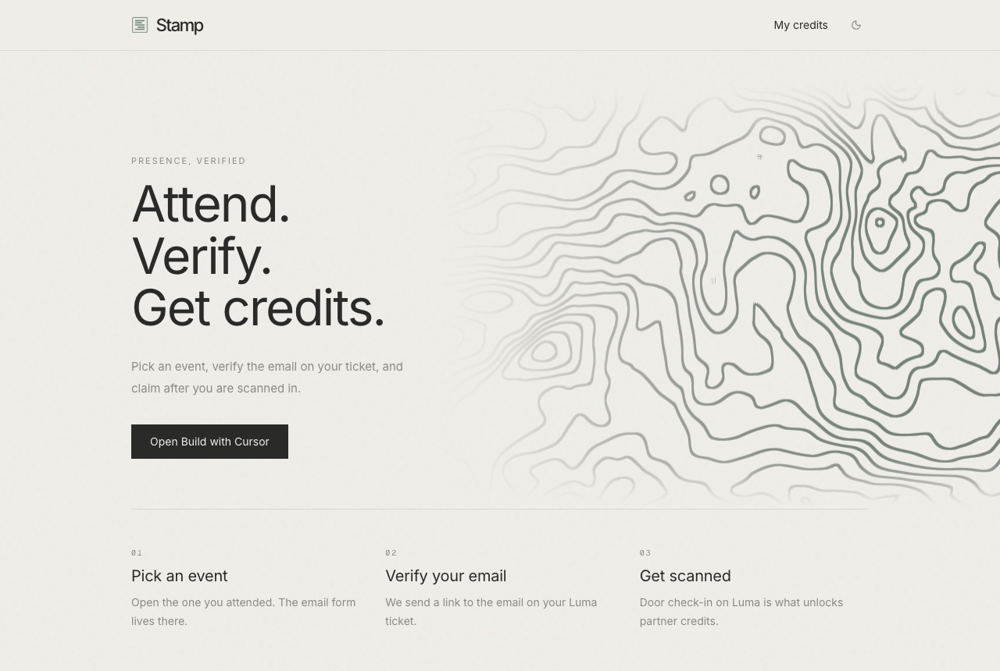
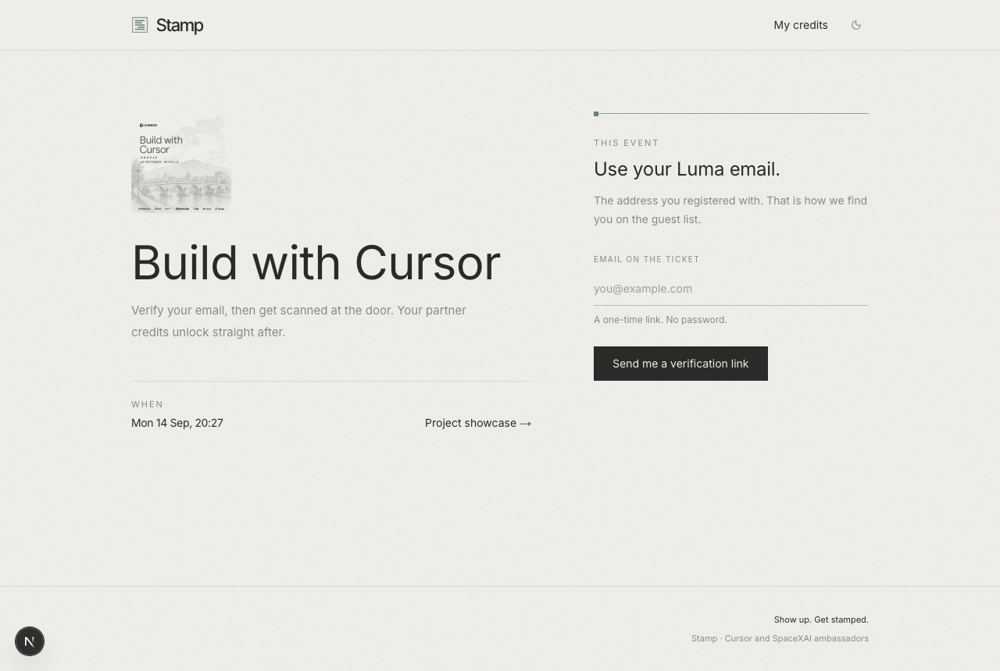
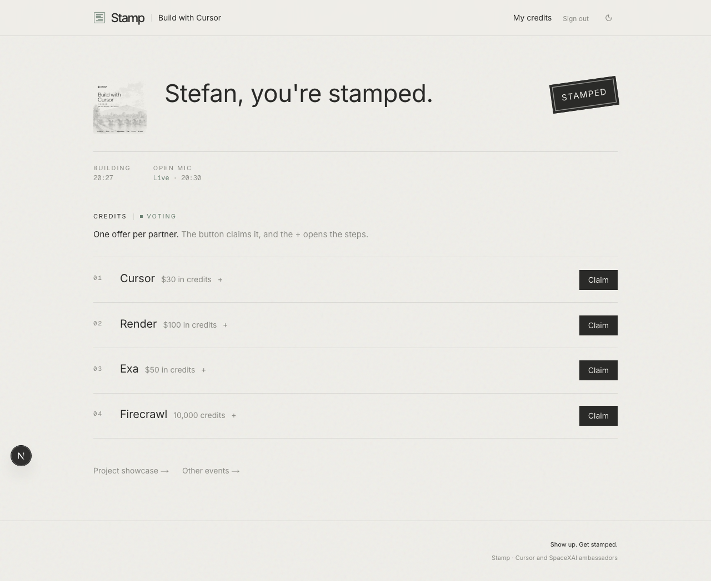
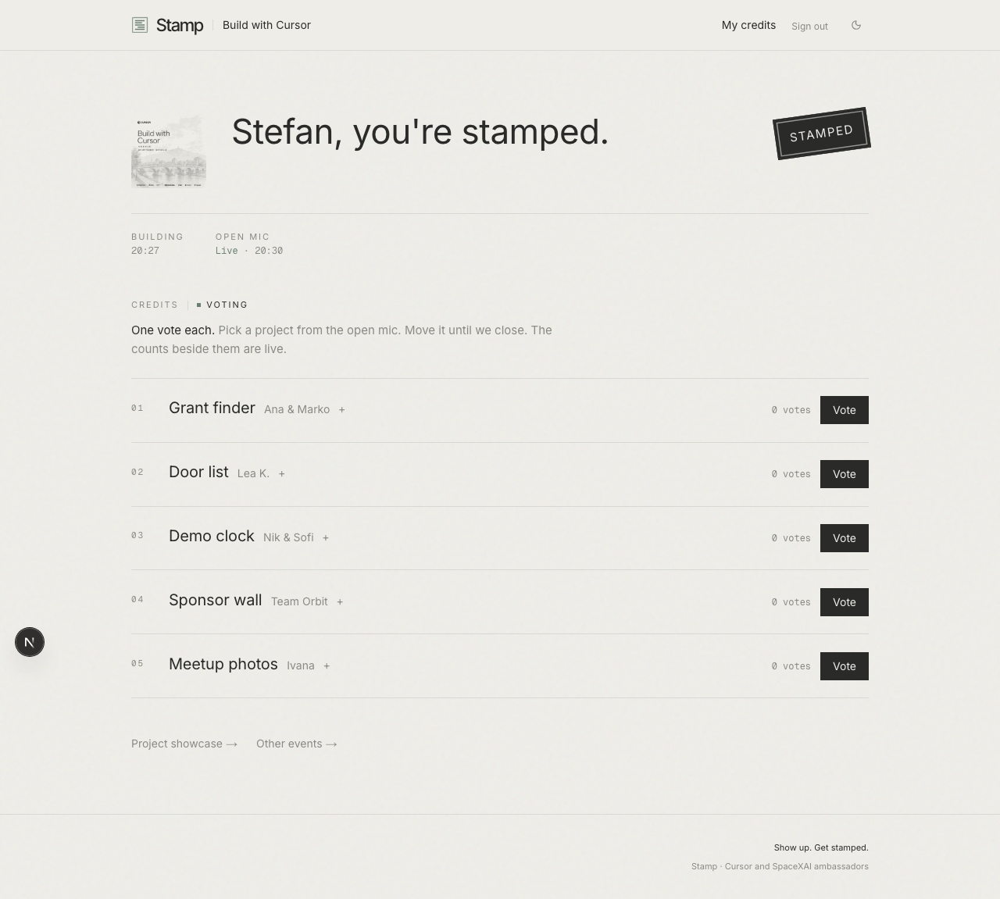
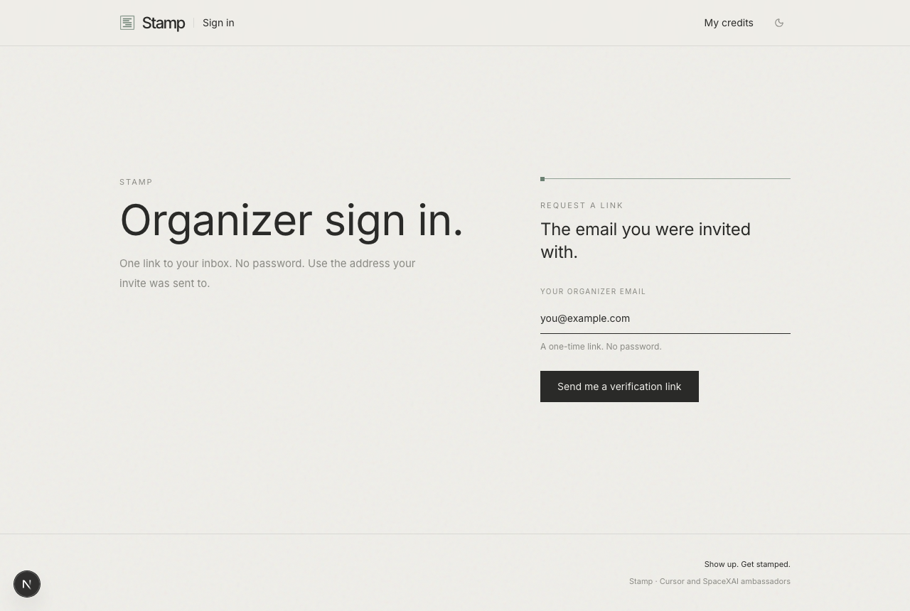
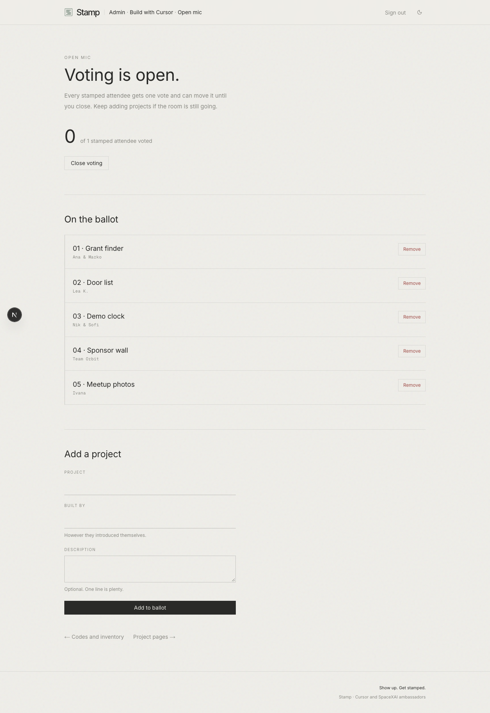

# Stamp

**The build night, handled.**

Guests prove they were in the room, pick up partner credits, and vote on the open mic. You import the Luma event and drop a CSV with credits. Spreadsheets at the door, and a show of hands for the mic, are gone.

**[Watch it](docs/images/walkthrough.webm).** Host first: import, codes, live ballot.

**[Run a build night](docs/run-a-build-night.md)** ·
**[Local](docs/for-developers.md)**

Two ways onto a live site:

- **You deploy this.** Fork, then the button below. Same evening.
- **We deploy it for you.** You never open Render. We send the URL.
  Import the Luma event and get approved as a host.

Import the event, upload the codes, scan people in with the Luma app,
open the vote when the last demo ends.

## On their computer

They land here. Then the event, their credits, then a vote.

## On your computer

`/admin`. Magic link. Paste the Luma URL. Upload the codes. Open the mic
when the last team sits down.

## Who gets in

Three kinds of people, and only the first is decided by you alone.

**Admins** are the addresses in `ADMIN_EMAILS`. They manage every event
and are the only ones who can confirm a host. Nothing else grants this.

**Invited hosts** are addresses an admin typed under **Hosts**. Typing
the address _is_ the confirmation, so they work immediately, on the
events they are appointed to.

**Luma-named hosts** are discovered from the event's host list. They land
**unconfirmed**. Luma's host list says who is named on a night, not what
they are allowed to do. A check-in volunteer and the person running the
event arrive identical. They sign in through the same form as guests and
see a "waiting on an admin" page until you confirm them under **Pending
hosts** on `/admin`.

A confirmed host of either kind can import an event themselves, but only
one Luma lists them as a host on. Anything else on the calendar is an
admin's to import.

Every address in `ADMIN_EMAILS` gets an email the first time a new
unconfirmed host appears, so the queue is not something you have to
remember to check. One message per sync, and only the first time.

Revoking takes manage away without deleting anything, and a later Luma
sync cannot quietly hand it back.

## You deploy this

Fork first, then use that button. It reads [`render.yaml`](render.yaml)
and creates the web service and the database. Replace
`REPLACE-WITH-THE-PUBLIC-REPO` with this repository's address once it is
public. Use **Starter**, not the free plan. A sleeping instance at the
door is a queue.

Edit `region` in [`render.yaml`](render.yaml) on both the service and
the database before you create the blueprint. They have to sit together,
near the room. The file ships as `frankfurt`.

Set these. Render generates `AUTH_SECRET` and `DATABASE_URL`.

`ADMIN_EMAILS`
Comma-separated. The only accounts that can confirm a host.

`LUMA_API_KEY`
From [Luma, API keys](https://luma.com/calendar/manage/api-keys), on the calendar this event is on. If that page has no keys, this calendar plan does not include the API.

`APP_URL`
The public site. Leave it empty on Render and the service address is used. Set it once a custom domain is in front.

`RESEND_API_KEY`
Your [Resend](https://resend.com) key. Production will not send mail without it.

`EMAIL_FROM`
An address on a domain that key has verified, e.g. `Stamp <hello@yourcity.dev>`.

`FOOTER_CREDIT`
Optional. `Cursor Berlin`. Also `APP_NAME` and `APP_TAGLINE`.

`AUTH_SECRET` has to be at least 32 characters, and not a placeholder.
Production will not start a session otherwise. Admin is the email inside
the session cookie, so a guessable secret is a forgeable admin, and
nothing else would notice. That is why it is checked.

A free Render instance skips `preDeployCommand`. Append
`&& npm run release` to `buildCommand`, or the database stays empty.

### Mail

There is no shared Stamp inbox. This deploy sends every link itself:
guest sign-in, `/admin`, host invites, the pending-host notice, and the
"credits are ready" mail after the door scan.

1. Create a [Resend](https://resend.com) account. The free one is enough.
2. Add an API key. That is `RESEND_API_KEY`.
3. Verify a domain you control (DKIM and SPF, in Resend's DNS panel).
4. Set `EMAIL_FROM` to an address on that domain.

Resend's onboarding sender is fine for one test to yourself. A room
needs a verified domain, or the links land in spam, or never leave.

`APP_URL` has to be this site. A leftover `localhost`, or another city's
origin, puts a dead link in every inbox.

**Mail only leaves the deployed service.** A checkout on your laptop
prints every message to the terminal instead of sending it, even when
the live key is in `.env`. Your local database holds real Luma
addresses, so this is on purpose. Nothing you do while developing can
reach a guest.

A host you invite does not set up mail. They use your Resend. Someone
who forks this for another city sets up their own key and domain.

### Once the URL is up

1. Sign in with an address from `ADMIN_EMAILS`.
2. On `/admin`, open **Setup check**. It stays shut when every line says Ready.
3. Press **Send me a test email**. It should arrive.
4. Import one Luma event, upload a two-line CSV, and claim a code with a checked-in guest before the night.

### If it misbehaves

- **The test email never arrives.** Check spam. Then check that `EMAIL_FROM` is on a domain Resend shows as verified. The onboarding sender only reaches your own inbox.
- **Luma rejected the key.** The key and the event have to be on the same calendar. A key from another city will not see this event.
- **Sign-in links point at localhost.** `APP_URL` is wrong. Clear it on Render, or set it to the public site.
- **The site is asleep at the door.** It is on the free plan. Move it to Starter.
- **The database is empty after deploy.** A free instance skipped the pre-deploy step. See the note under the variable list.

### Cost

One Starter web service and the smallest database, in the same region.
Render bills those. Resend's free allowance covers a night of sign-in
mail. Luma's plan only matters if the calendar cannot issue an API key.

## What is guarded

A live night is a room full of people with a link, so the app assumes
some of them will poke at it.

- **Luma's rate budget is protected.** Host discovery and roster sync
  each claim a slot before calling Luma, so a page left open on thirty
  phones costs one request, not thirty. Nothing an attendee can load
  reaches Luma on its own.
- **Sign-in, claims, and rechecks are rate limited**, per email and per
  IP, in the database rather than in memory. A venue shares one public
  IP, so the per-email limit is the one that matters.
- **Codes cannot be handed out twice.** Assignment is a single
  conditional statement, so two simultaneous claims produce one code and
  one person who gets nothing, not two holders of the same string.
- **One vote per attendee**, enforced by the schema rather than the UI.
- **Security headers and a CSP** ship with the app. Framing is refused,
  and `/api/claim` checks the request origin.
- **Admin actions are written to an audit log** on `/admin`.

`npm run stress` runs the concurrency checks against a throwaway event
that deletes itself, so it is safe to run against a database that
already has real nights in it.

## We deploy it for you

You stay out of Render and Resend. We send the URL.

Import the Luma event. Get approved as a host. From there it is
[the same night](docs/run-a-build-night.md): CSV, door scan, open mic.

## Local

Node 20+. No Docker. `npm run db:start` runs a local Postgres through
Prisma. See **[docs/for-developers.md](docs/for-developers.md)**.

## License

[MIT](LICENSE). Provided as is, without warranty of any kind.

A license cannot cover this: the app holds a guest list. If you deploy
it, the addresses in it are yours to look after.
