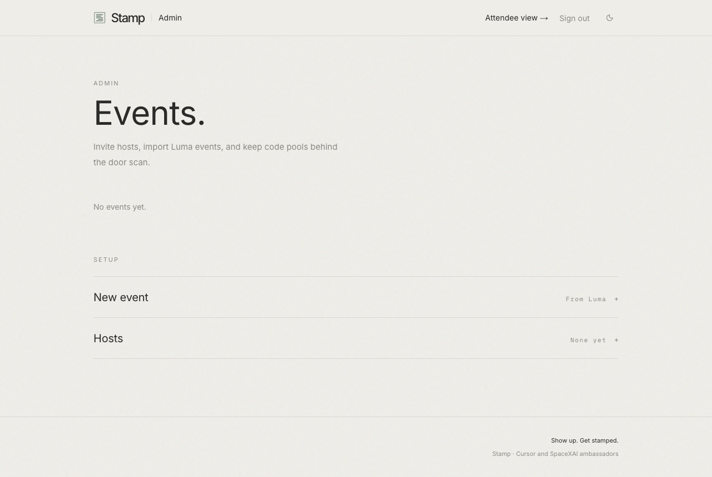
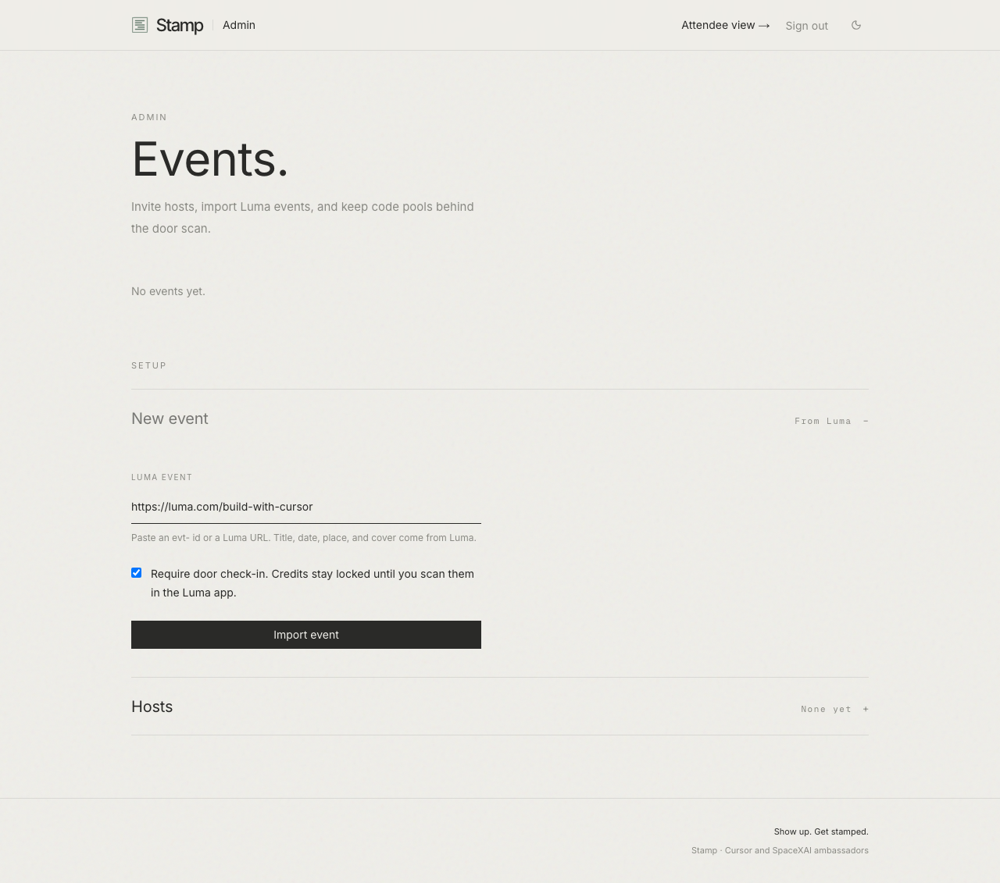
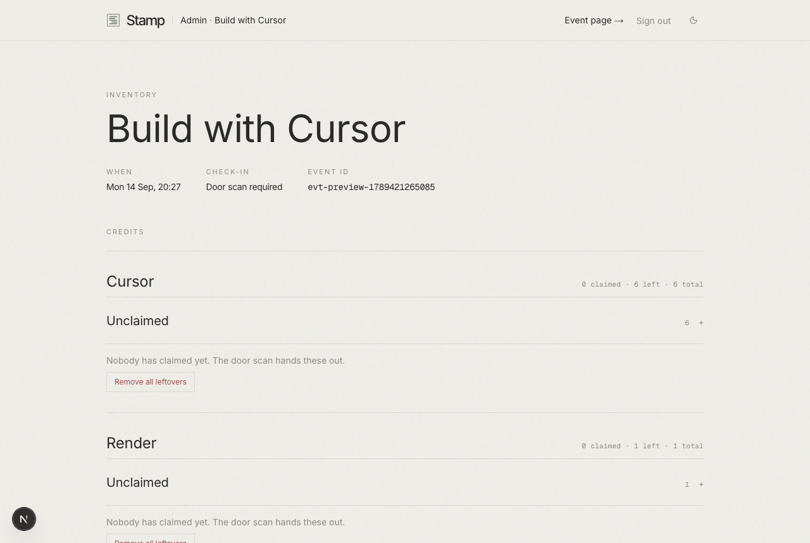

# How to run a build night

Four moves. Two before doors. Stamp does the rest: claims, the ballot,
leftover codes.

Cafe nights without a mic skip voting and stay off `/showcase`.

[Watch it](images/walkthrough.webm). Import, codes, live ballot.
[Deploy, or use the one we host](../README.md)

## `/admin`

Magic link to an address in `ADMIN_EMAILS`, or a confirmed Host. Unrelated
to Luma calendar-admin. Hosts only see events they are appointed to.
Signed-out pages point there with **Hosting an event? Sign in to manage
it**. An address Stamp does not know as a host sees "Not a host yet."

An address Luma names as host on the event is discovered automatically,
but lands **unconfirmed**. Luma says who is named on a night, not who
may run it. They see a "waiting on an admin" page until someone in
`ADMIN_EMAILS` confirms them under **Pending hosts**. Admins are emailed
when a new one appears. Inviting an address by hand skips the wait,
because an admin typed it.




## Import

**Setup → New event.** `evt-…` or a Luma URL. Title, time, place, cover
come from the API. Leave door check-in on unless you really want credits
unlocked without a scan.



Duplicate `lumaEventId` is rejected. Appoint yourself as a host on the
existing row instead of importing twice. A host can only import an event
Luma lists them as a host on. An admin imports the rest.

## Inventory

`/admin/e/[slug]`. One CSV per partner (header `code`, one token or URL
per row). Cursor accepts short tokens and full referral links.

```
code
CURSOR-BERLIN-001
CURSOR-BERLIN-002
```

Unclaimed rows can be removed. Claimed rows stay with that attendee. A
code partner with no file on this night does not show for guests. Shared
coupons still need one row per guest, or only the first claim wins.

Cursor is already in the catalog. A new partner takes a name, a perk,
and how-to steps. The CSV is optional: without one, the partner is a
how-to that only guests stamped at this event see. A partner a host adds
stays with that event. One an admin adds with codes joins the list every
event picks from. Offers typed here live in this deploy's database, not
in the repo.



## Door

Scan in **Luma**, not here. Guests hit `/`, open the event, request a
link with the ticket email, and stay on `/status`. Stamp watches
`checked_in_at`. **Check again** is for one missed webhook, not a
room-wide refresh.


## Open mic

`/admin/e/[slug]/vote` (or **Run the open mic**). Add projects as they
present, **Open voting**, **Close voting**. One vote per stamped guest,
movable until close. Auto-close is six hours after open, not Luma
`endAt`. Re-open starts a new window. Ranking is public.


## After

Guests can still read what they claimed. Build nights that had a vote show up
on `/showcase` after `endAt`. **Setup → Leftovers** moves unclaimed codes
to the next event; claimed ones do not move.

## Failures

**Cannot claim or vote.** Ticket email, Luma `approved`, then scanned.

**Credits stay locked.** Not scanned, or they left `/status`.

**"Voting is not open".** Not opened, already closed, or the six hours lapsed.

**Magic link is `localhost`, or never arrives.** `APP_URL` or `RESEND_API_KEY`.

**Mail rejected, or spam.** `EMAIL_FROM` is not on a domain verified in this Resend account.

**Event not on this calendar.** `LUMA_API_KEY` is a different calendar than the `evt-`.

**Helper cannot see the event.** Invite under **Hosts**, appoint on the event. Or add them to `ADMIN_EMAILS`.

**Helper sees "waiting on an admin".** Luma named them, so they are unconfirmed. Confirm under **Pending hosts** on `/admin`.
